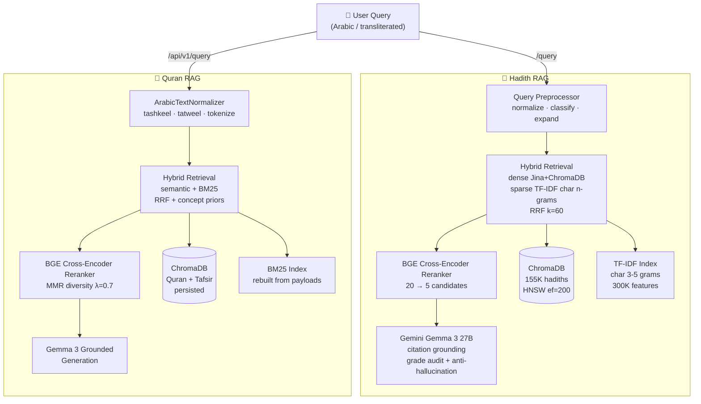
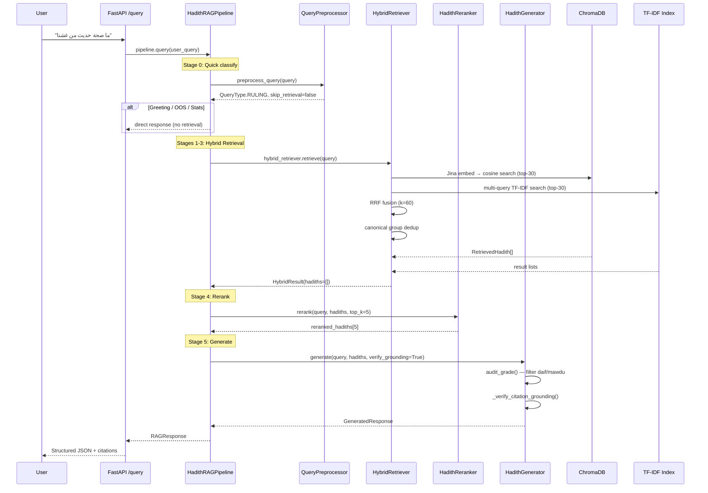
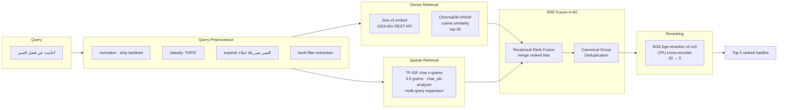
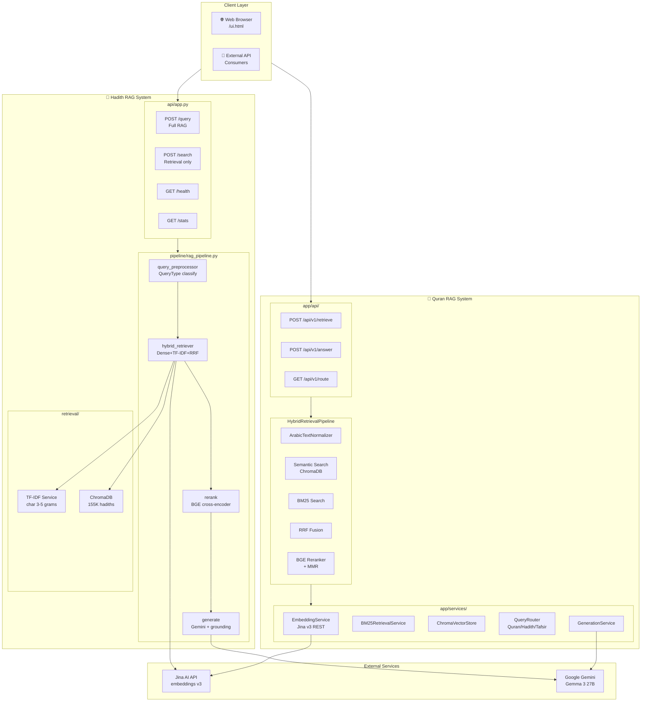
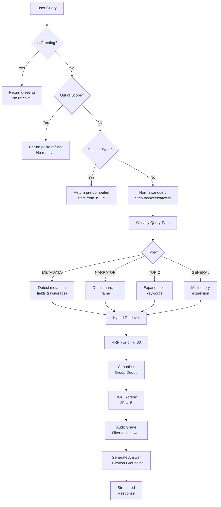

# YaqeenAI — Repository Overview

> **Repository**: `yaqeen-llm-git` — Dual Arabic Islamic RAG Systems  
> **Systems**: Hadith RAG (155K+ hadiths) · Quran RAG (Quran + Tafsir)  
> **Documentation version**: 2026-04-20

---

## Table of Contents

1. [Executive Summary](#1-executive-summary)
2. [System Architecture](#2-system-architecture)
3. [Software Architect Perspective](#3-software-architect-perspective)
4. [Software Developer Perspective](#4-software-developer-perspective)
5. [Product Manager Perspective](#5-product-manager-perspective)
6. [Issues, Conflicts & Technical Debt](#6-issues-conflicts--technical-debt)
7. [Improvements & Recommended Fixes](#7-improvements--recommended-fixes)
8. [Architecture Diagrams](#8-architecture-diagrams)

---

## 1. Executive Summary

This repository contains two production-grade **Retrieval-Augmented Generation (RAG)** systems for Arabic Islamic knowledge:

| System         | Domain                     | Dataset                                  | Key Tech                                                |
| -------------- | -------------------------- | ---------------------------------------- | ------------------------------------------------------- |
| **Hadith RAG** | Hadith retrieval & grading | 155,502 hadiths (Dorar Al-Seniyyah)      | ChromaDB + TF-IDF + BGE Reranker + Gemini (Gemma 3 27B) |
| **Quran RAG**  | Quran + Tafsir retrieval   | Quranic ayahs + multiple tafsir editions | ChromaDB + BM25 + BGE Reranker + Gemma 3                |

Both systems use **hybrid retrieval** (dense + sparse → RRF fusion → reranking → generation) with strict citation grounding and Arabic-first processing. The indexing phase runs on Google Colab (GPU); serving runs locally on CPU.

---

## 2. System Architecture

### 2.1 High-Level Architecture



### 2.2 Data Flow — Hadith RAG



### 2.3 Hadith RAG — Retrieval Pipeline



---

## 3. Software Architect Perspective

### 3.1 Architectural Patterns

**Pattern 1 — Hybrid Retrieval with RRF**
Both systems use the same hybrid retrieval pattern: dense (embedding + vector search) merged with sparse (keyword search) via **Reciprocal Rank Fusion** with k=60. RRF is score-agnostic, parameter-free, and outperforms weighted score fusion in IR benchmarks.

**Pattern 2 — Pre-filter → Rerank → Diversity**
The Quran RAG pipeline specifically implements: RRF pre-filter (threshold 0.008) → BGE cross-encoder rerank → MMR diversity (λ=0.7). This cascades precision filters to minimize expensive cross-encoder calls on irrelevant candidates.

**Pattern 3 — Offline Indexing / Online Querying**
The indexing phase (embedding 155K hadiths, building ChromaDB) runs on Google Colab GPU and is decoupled from serving. The server runs on CPU with pre-computed artifacts.

**Pattern 3 — Intent-Aware Generation**
Both systems use query-type-aware generation with separate system prompts for general/metadata/narrator/explain queries, plus answer-intent policy (EXPLANATORY/VERIFICATION/COLLECTION/LOOKUP) that modifies how evidence is evaluated and presented.

### 3.2 Architectural Strengths

1. **Modular service isolation** (Quran RAG): Each service (embedding, BM25, reranker, generation) is independently injectable and replaceable. The `VectorStoreProtocol` abstraction enables swapping ChromaDB for Qdrant/Milvus.

2. **Canonical grade audit system** (Hadith RAG): The `audit_grade()` function separately evaluates display bucket vs. detailed ruling, detects conflicts, and classifies usability for evidence — a well-designed domain model.

3. **Domain-specific retrieval overrides** (Quran RAG): Hardcoded concept-priority results for charity/zakat queries inject specific ayah refs (2:261, 2:262, etc.) when charity terms are detected — a pragmatic domain heuristic that outperforms pure similarity search for high-value queries.

4. **Lazy initialization**: Both pipelines defer heavy component loading (embedding API, reranker model, ChromaDB connection) until first use, enabling fast server startup.

### 3.3 Architectural Weaknesses

1. **Duplicate codebases**: Hadith RAG and Quran RAG share ~70% of the algorithmic patterns (RRF, BGE reranking, Jina embeddings, Arabic normalization, generation prompts) but are implemented as completely separate codebases with no shared primitives. A future `yaqeen_core` package could extract: RRF fusion, ArabicTextNormalizer, JinaEmbeddingService, BGE Reranker wrapper, grade audit utilities.

2. **Local-only vector DB**: Both systems use `chromadb.PersistentClient` with local file paths. Scaling to multiple server instances requires migrating to a client/server vector DB (Qdrant, Milvus) or managed Chroma.

3. **Sparse index synchronization**: TF-IDF (Hadith RAG) and BM25 (Quran RAG) are built offline and rebuilt at startup from Chroma payloads. If the indexing code changes, old persisted sparse indexes become incompatible — forcing a full rebuild.

4. **No caching layer for generated answers**: Repeated queries re-run the full LLM generation. A simple cache (Redis or even file-based) on `(query_hash, hadith_set_hash)` → answer could eliminate redundant API calls.

5. **Single-point-of-failure API keys**: Both systems require `JINA_API_KEY` and `GEMINI_API_KEY` as environment variables with no fallback or caching of embeddings for offline use.

### 3.4 Scalability Considerations

| Dimension     | Current                       | Scalability Concern                 |
| ------------- | ----------------------------- | ----------------------------------- |
| ChromaDB      | Local persistent              | Single-node; no replication         |
| TF-IDF index  | Pickle file, in-memory        | ~400MB RAM for 300K features        |
| BM25 index    | Rebuilds from Chroma payloads | O(n) startup time for large corpora |
| Embedding API | Jina REST, rate-limited       | No local embedding model fallback   |
| Generation    | Gemini API, rate-limited      | No local model option               |
| Server        | Single uvicorn process        | No horizontal scaling path          |

---

## 4. Software Developer Perspective

### 4.1 Project Structure

```
yaqeen-llm-git/
├── hadith_rag/
│   ├── api/
│   │   ├── app.py          # FastAPI server (query, search, health, stats, UI)
│   │   └── ui.html         # Single-page web UI (vanilla HTML/JS)
│   ├── pipeline/           # Sequential pipeline modules
│   │   ├── config.py        # Pydantic Settings + grade audit logic
│   │   ├── rag_pipeline.py  # Orchestrator (HadithRAGPipeline class)
│   │   ├── embed_query.py  # Jina REST API embedder
│   │   ├── retrieve.py      # ChromaDB retriever + RetrievedHadith dataclass
│   │   ├── rerank.py        # BGE cross-encoder reranker
│   │   ├── generate.py      # Gemini generator + citation grounding
│   │   ├── answer_policy.py # AnswerIntent classification
│   │   └── arabic_normalizer.py
│   ├── retrieval/
│   │   ├── hybrid_retriever.py   # Dense + Sparse + RRF + dedup
│   │   ├── tfidf_service.py      # TF-IDF char n-gram service
│   │   ├── query_expander.py     # Multi-query expansion
│   │   └── query_preprocessor.py # normalize · classify · detect metadata
│   ├── ingestion/
│   │   └── pipeline.py      # Raw JSON → cleaned JSONL
│   └── notebooks/
│       ├── 01_data_prep.ipynb    # [Colab] clean + normalize + stats
│       └── 02_index_build.ipynb  # [Colab] embed + ChromaDB + TF-IDF build
│
├── quran_rag/
│   ├── app/
│   │   ├── main.py              # FastAPI + lifespan (load Chroma + rebuild BM25)
│   │   ├── api/
│   │   │   ├── retrieval_router.py  # /api/v1/retrieve · /answer · /route · /health
│   │   │   └── ui_router.py
│   │   ├── core/
│   │   │   └── config.py        # Pydantic Settings (BM25, RRF, generation config)
│   │   ├── models/
│   │   │   └── schemas.py       # Pydantic domain models
│   │   ├── services/
│   │   │   ├── hybrid_retrieval.py    # HybridRetrievalPipeline (full pipeline)
│   │   │   ├── bm25_service.py        # BM25RetrievalService
│   │   │   ├── chroma_store.py        # ChromaVectorStore wrapper
│   │   │   ├── embedding_service.py  # Jina embed service
│   │   │   ├── reranker_service.py    # BGE reranker service
│   │   │   ├── query_router.py        # Keyword-based routing (Quran/Hadith/Tafsir)
│   │   │   ├── vector_store_factory.py # Factory pattern for vector store
│   │   │   └── generation_service.py   # Gemma 3 grounded answer generation
│   │   ├── preprocessing/
│   │   │   └── arabic_normalizer.py  # ArabicTextNormalizer
│   │   └── ingestion/
│   │       ├── pipeline.py          # run_ingestion_pipeline()
│   │       ├── quran_api_client.py  # Async Quran API client
│   │       └── chunker.py           # QuranChunker (1 ayah = 1 chunk)
│   └── requirements.txt
```

### 4.2 Code Quality Observations

**Strengths:**

- Well-documented module headers explaining architecture rationale
- Consistent Pydantic models for API request/response validation
- Structured logging throughout (`loguru` in Quran RAG, `logging` in Hadith RAG)
- Dataclasses used extensively for domain objects (`RetrievedHadith`, `GeneratedResponse`, `Citation`, etc.)
- Comprehensive docstrings in key files (`quran_rag/app/main.py`, `quran_rag/app/services/hybrid_retrieval.py`)

**Weaknesses:**

- **Mixed logging libraries**: Hadith RAG uses `logging`, Quran RAG uses `loguru` — inconsistent
- **No type stubs or py.typed markers**: Strict mode mypy would report many type issues
- **No unit tests**: No `tests/` directory found in either system
- **Procedural vs. serviceoriented mismatch**: Hadith RAG uses script-style pipeline modules; Quran RAG uses DDD-lite services. A developer moving between them needs to re-learn the patterns.
- **Inline comments**: Some comment blocks (e.g., `generate.py` lines 1078-1085) explain workarounds rather than clean code
- **Hardcoded domain heuristics**: `_get_concept_priority_results` hardcodes charity ayah refs directly in the retrieval logic — maintainability risk if more topics are added

### 4.3 Conventions

| Convention             | Hadith RAG                                          | Quran RAG                                      |
| ---------------------- | --------------------------------------------------- | ---------------------------------------------- |
| Entry point            | `python -m pipeline.rag_pipeline`                   | `uvicorn app.main:app`                         |
| Settings               | `pipeline.config.Settings` (dotenv loaded manually) | `app.core.config.Settings` (Pydantic Settings) |
| Logging                | `logging` module                                    | `loguru`                                       |
| Service initialization | Lazy (on first `retrieve()` call)                   | Lifespan context manager                       |
| Dataclass naming       | `RetrievedHadith`, `GeneratedResponse`              | `RetrievalResult`, `RetrievalResponse`         |
| Error handling         | HTTPException + general catch-all                   | `try/except` with logger.warning               |

---

## 5. Product Manager Perspective

### 5.1 Feature Overview

#### Hadith RAG Features

| Feature                   | Description                                                       | Status        |
| ------------------------- | ----------------------------------------------------------------- | ------------- |
| **Hybrid Retrieval**      | Dense (Jina+ChromaDB) + Sparse (TF-IDF char n-grams) + RRF fusion | ✅ Production |
| **Grade-Aware Filtering** | Filter by sahih/hasan/daif/mawdu                                  | ✅ Production |
| **Narrator Search**       | Query by narrator name ("أحاديث رواها أبو هريرة")                 | ✅ Production |
| **Book/Source Filter**    | Extract masdar filter from query text ("في صحيح البخاري")         | ✅ Production |
| **Citation Grounding**    | LLM must cite only retrieved hadiths; verified at generation      | ✅ Production |
| **Grade Audit**           | Daif/mawdu excluded from evidence; conflicts detected             | ✅ Production |
| **Metadata Queries**      | Answer about rawi/grade/masdar/safha directly from metadata       | ✅ Production |
| **Multi-Query Expansion** | Reformulation-based expansion (question→statement)                | ✅ Production |
| **Canonical Group Dedup** | Near-duplicate hadiths deduplicated by normalized matn            | ✅ Production |
| **Dataset Statistics**    | Pre-computed stats for instant "how many sahih hadiths" answers   | ✅ Production |
| **Early-Exit Routing**    | Greeting/OOS/Stats skip retrieval entirely                        | ✅ Production |

#### Quran RAG Features

| Feature                        | Description                                            | Status        |
| ------------------------------ | ------------------------------------------------------ | ------------- |
| **Hybrid Retrieval**           | Semantic (ChromaDB) + BM25 + RRF                       | ✅ Production |
| **Tafsir-Aware Search**        | Detects tafsir queries; routes to tafsir content       | ✅ Production |
| **Exact Ayah Lookup**          | Shortcut for exact surah:ayah reference queries        | ✅ Production |
| **Concept Priority Injection** | Charity/zakat topic → specific ayah refs injected      | ✅ Production |
| **MMR Diversity**              | Maximal Marginal Relevance for result diversity        | ✅ Production |
| **Context Window Expansion**   | Adjacent ayah chunks for surrounding context           | ✅ Production |
| **Query Router**               | Routes to Quran/Hadith/Tafsir sub-RAGs by keyword      | ✅ Production |
| **Multi-Edition Support**      | Multiple tafsir editions (Muyassar, Mukhtasar, Tabari) | ✅ Production |
| **Grounded Generation**        | Strict citation requirements for Gemma 3 output        | ✅ Production |

### 5.2 User Flows

**Flow 1 — Hadith Verification Query**

```
User: "ما صحة حديث من غشنا فليس منا"
→ QueryPreprocessor: RULING type, extracts hadith text
→ HybridRetriever: dense+sparse → RRF → dedup
→ HadithReranker: top-5 reranked
→ HadithGenerator: audit_grade() → Gemma 3 → citation verification
→ Response: answer + citations + grade + ignored_narrations + timing
```

**Flow 2 — Quran Tafsir Query**

```
User: "اشرح آية الكرسي"
→ ArabicTextNormalizer: tafsir query detected
→ QueryRouter: routes to tafsir sub-RAG
→ HybridRetrievalPipeline: exact tafsir lookup + BM25 fallback
→ Reranking + MMR
→ GenerationService: grounded answer
```

### 5.3 Business Alignment

- **Trust & Safety**: Both systems prioritize hallucination prevention through citation grounding verification and explicit "no fabricated sources" refusals.
- **Arabic-First**: Both systems handle Arabic natively (tashkeel removal, alef normalization, RTL text in UI) — critical for the target audience.
- **Citation Requirements**: Every answer includes explicit source + page + narrator + grade — aligning with Islamic scholarly standards.
- **Differentiation**: General LLMs hallucinate Islamic rulings. This system's explicit citation and grade-filtering is a strong market differentiator.

### 5.4 Strategic Questions

1. **Continuous Data Ingestion**: The current pipeline requires manual Colab re-run for new hadiths/tafsir. An automated incremental ingestion pipeline is needed as the dataset grows.
2. **B2B vs B2C**: If B2B, rate limiting, API key management, and usage telemetry are required. If B2C, a web UI and user feedback mechanism (thumbs up/down) should be built.
3. **User Feedback Loop**: No endpoint exists for users to rate answer quality. This telemetry is essential for improving RRF weights and query routing over time.
4. **Local Model Fallback**: Both systems depend on external APIs (Jina, Gemini). A local embedding + generation option (e.g., llama.cpp server) would enable offline/air-gapped deployment.
5. **Multi-language Support**: Current focus is Arabic. English/Urdu transliteration is handled for queries but not for response generation quality.

---

## 6. Issues, Conflicts & Technical Debt

### 6.1 Critical Issues

#### Issue 1: **Commented-Out API Client Code** (`generate.py` lines 21, 857-867, 1095-1106)

The file `hadith_rag/pipeline/generate.py` contains **both** Groq and Gemini client code, with Groq fully commented out but still present:

```python
# from groq import Groq        # line 21 — commented import
from google import genai       # active import
...
self.client = genai.Client(api_key=self.api_key)   # line 866 — Gemini active
# self.client = Groq(api_key=self.api_key)          # line 867 — Groq commented
```

The `generate_content` call (Gemini) is active at line 1087, with `chat.completions.create` (Groq) commented out at lines 1095-1106. This dual-client structure makes the code confusing to maintain and indicates an incomplete migration from Groq to Gemini.

**Action**: Remove all commented-out Groq code. Confirm Gemini is the sole client.

#### Issue 2: **Metadata Field Name Mismatch** (`retrieve.py` lines 147-153 vs `hybrid_retriever.py` lines 352-358)

The `HadithRetriever` reads ChromaDB metadata with these field names:

- `mohadeth` (line 147)
- `book` (line 148)
- `numberOrPage` (line 149)
- `hasExplanation` (line 153)

The `HybridRetriever` fetches sparse-only results via `collection.get()` and uses **different field names**:

- `mohadeth` (line 352)
- `book` (line 353)
- `numberOrPage` (line 354)
- `hasExplanation` (line 358)

This is **internally consistent** but fragile — the field names are documented in comments but not enforced by a schema. If the Colab indexing code changes these field names, the mismatch would only surface at query time.

**Action**: Create a shared constants file or dataclass with canonical ChromaDB metadata field names, used by both the indexing notebook and the retrieval code.

### 6.2 Conflicts

#### Conflict 1: **Architecture Pattern Mismatch**

Hadith RAG and Quran RAG implement fundamentally different architectural styles:

| Aspect         | Hadith RAG                         | Quran RAG                          |
| -------------- | ---------------------------------- | ---------------------------------- |
| Style          | Procedural pipeline modules        | DDD-lite service classes           |
| Settings       | Manual `load_dotenv()` + class     | Pydantic Settings (`BaseSettings`) |
| Logging        | `logging` module                   | `loguru`                           |
| Initialization | Lazy (`__init__` + first-use init) | Lifespan context manager           |
| Protocol       | No abstraction layer               | `VectorStoreProtocol` interface    |

This creates maintenance overhead: a developer working on both systems must understand two different patterns.

#### Conflict 2: **Duplicate Arabic Normalizers**

Both systems have `arabic_normalizer.py` with overlapping functionality:

- `hadith_rag/pipeline/arabic_normalizer.py` — handles `_TASHKEEL`, `_TATWEEL`, `_WHITESPACE`, `_ALEF_VARIANTS`
- `quran_rag/app/preprocessing/arabic_normalizer.py` — same patterns plus `ArabicTextNormalizer` class

The Quran version is more feature-complete (includes `detect_language`, `is_tafsir_query`, `normalize_ayah_ref`, `extract_retrieval_focus`, `tokenize_arabic`). The Hadith version is simpler with just static functions.

**Action**: Extract common normalization logic into `yaqeen_core/text_processing/arabic_normalizer.py`.

#### Conflict 3: **Grade Classification Logic Duplication**

Hadith RAG's `pipeline/config.py` implements sophisticated grade auditing (`audit_grade`, `resolve_grade_bucket`, `resolve_grade_label`). This logic is domain-specific to hadith grading and does not exist in Quran RAG, but the overall pattern of "resolve from multiple conflicting sources" could be generalized.

#### Conflict 4: **Query Classification Systems Are Different**

- Hadith RAG: `QueryType` enum (GREETING, OUT_OF_SCOPE, DATASET_STATS, METADATA, NARRATOR, TOPIC, GENERAL, etc.)
- Quran RAG: `QueryRouter` keyword-based routing to sub-RAGs (Quran/Hadith/Tafsir)

These serve similar purposes (routing queries to appropriate pipelines) but are completely different implementations with no shared interface.

### 6.3 Technical Debt

| Debt Item                   | Location                                                   | Severity  | Description                                                                                                   |
| --------------------------- | ---------------------------------------------------------- | --------- | ------------------------------------------------------------------------------------------------------------- |
| No test suite               | Both systems                                               | 🔴 High   | No `tests/` directory. No unit tests for grade audit, RRF fusion, query classification, or generation prompts |
| Duplicate `__init__.py`     | `hadith_rag/api/__init__.py`, `hadith_rag/app/__init__.py` | 🟡 Low    | Both empty, unnecessary nesting                                                                               |
| Inline import               | `generate.py` line 1028                                    | 🟡 Low    | `_extract_hadith_text_from_explain_query` imported inside method instead of module level                      |
| Magic strings               | `hybrid_retriever.py` lines 351-358                        | 🟡 Medium | Metadata field names hardcoded without constants                                                              |
| No `py.typed` marker        | Both systems                                               | 🟡 Low    | No PEP 561 type marker                                                                                        |
| Inconsistent error handling | `api/app.py` vs `quran_rag/app/api/retrieval_router.py`    | 🟡 Medium | Hadith uses catch-all HTTPException handler; Quran RAG has none                                               |
| No CI/CD                    | Both systems                                               | 🔴 High   | No GitHub Actions, no linting, no type checking in CI                                                         |
| No requirements pinning     | `requirements.txt` files                                   | 🟡 Medium | No version pins (e.g., `chromadb>=0.4.22`)                                                                    |
| Hardcoded charity ayah refs | `quran_rag/app/services/hybrid_retrieval.py` lines 742-761 | 🟡 Medium | `_get_concept_priority_results` hardcodes 9 specific ayah refs; maintainability concern as topics grow        |

---

## 7. Improvements & Recommended Fixes

### 7.1 Immediate Fixes (High Priority)

**F1: Clean up commented-out Groq code**

- File: `hadith_rag/pipeline/generate.py`
- Remove all commented-out Groq imports and calls (lines 21, 857, 867, 1095-1106)
- Keep only the active Gemini client path

**F2: Create shared ChromaDB metadata field constants**

- File: `hadith_rag/retrieval/metadata_fields.py` (new)
- Define `CHROMA_METADATA_FIELDS = {"muhaddith": "mohadeth", "masdar": "book", ...}`
- Use in both `retrieve.py` and `hybrid_retriever.py`

**F3: Add minimal test suite**

- Create `tests/` directory
- Test `audit_grade()`: sahih/daif/mawdu/conflict cases
- Test `reciprocal_rank_fusion()`: known input/output
- Test `preprocess_query()`: query type classification
- Target: 80% coverage on `config.py` and `query_preprocessor.py`

**F4: Extract shared `ArabicNormalizer`**

- Create `yaqeen_core/text_processing/arabic_normalizer.py`
- Move common patterns (tashkeel, tatweel, alef normalization) from both systems
- Keep `ArabicTextNormalizer` class from Quran RAG as the canonical implementation

### 7.2 Short-Term Improvements (Medium Priority)

**F5: Add `pyproject.toml` with uv/pip compatibility**

- Pin all dependencies with upper and lower bounds
- Add `py.typed` marker
- Configure `ruff` for linting, `mypy` for type checking

**F6: Add GitHub Actions CI pipeline**

- Run `ruff check` and `mypy --strict`
- Run a minimal test suite
- Check that `.env.example` is updated when new env vars are added

**F7: Unify logging across both systems**

- Choose `loguru` as the standard (already used in Quran RAG)
- Add `loguru` to Hadith RAG requirements, replace `logging` calls

**F8: Add API key validation at startup**

- Both systems should fail fast if required API keys are missing, not at first query time

**F9: Implement answer caching**

- Add LRU cache on `(query, hadith_set_hash)` → `GeneratedResponse`
- Reduces redundant Gemini API calls for repeated queries

### 7.3 Long-Term / Strategic (Lower Priority)

**F10: Extract `yaqeen_core` package**
A shared library containing:

- `arabic_normalizer.py` (F4)
- `jina_embedding_service.py`
- `bge_reranker_service.py`
- `rrf_fusion.py`
- `grade_audit.py`
- `query_classifier.py` (unified QueryType)

Both systems would depend on `yaqeen_core`, eliminating the duplicate code problem.

**F11: Vector DB migration path**

- Abstract `VectorStoreProtocol` (already exists in Quran RAG) into `yaqeen_core`
- Add Qdrant implementation as an alternative
- Add migration script from local Chroma → Qdrant

**F12: Incremental data ingestion pipeline**

- Script that takes a new batch of hadiths/tafsir
- Runs embedding + indexing incrementally (no full rebuild)
- Updates TF-IDF/BM25 indexes incrementally

**F13: Local model fallback**

- Add `yaqeen_llm` server option using llama.cpp
- Detect API key availability → choose remote vs local
- Fallback embeddings using `sentence-transformers` multilingual model

**F14: User feedback endpoint**

- `POST /feedback` — `{ request_id, hadith_id, helpful: bool, correction: str }`
- Store in SQLite for analysis
- Use to audit RRF weight quality

---

## 8. Architecture Diagrams

### 8.1 System Architecture — Full View



### 8.2 Query Processing Flow



### 8.3 Quran RAG — Hybrid Retrieval Detail

```mermaid
flowchart TD
    QRY["User Query"]

    QRY --> NORM["ArabicTextNormalizer"]
    NORM --> LANG["Detect Language<br/>+ tafsir query"]

    LANG --> C1{Ayah Ref<br/>Exact lookup?}
    C1 -->|Match| R1["Direct return<br/>No fusion needed"]
    C1 -->|No match| C2{Tafsir exact<br/>lookup?}

    C2 -->|Match| R2["Tafsir return<br/>+ Quran match"]
    C2 -->|No match| SQ["Single word<br/>Arabic?"]

    SQ -->|Yes| EQ["Expand to<br/>القرآن الكريم + query"]
    SQ -->|No| KQ["Keep query<br/>as-is"]

    EQ --> SS["Semantic Search<br/>ChromaDB cosine"]
    KQ --> SS

    SS --> BM25["BM25 Search"]

    BM25 --> C3{BM25 has<br/>results?}
    C3 -->|No| FALLBACK["BM25 contains<br/>fallback"]
    C3 -->|Yes| RRF["RRF Fusion<br/>semantic + BM25"]

    FALLBACK --> RRF

    RRF --> CP{Charity/Zakat<br/>concept?"}
    CP -->|Yes| INJECT["Inject priority<br/>ayah refs 2:261, 2:262..."]
    CP -->|No| RERANK["Rerank candidates<br/>BGE cross-encoder"]

    INJECT --> RERANK

    RERANK --> BOOST["Apply boosts:<br/>focus term + domain<br/>+ non-anchor filter"]

    BOOST --> GRP["Group by<br/>surah:ayah"]

    GRP --> MMR["MMR diversity<br/>λ=0.7"]

    MMR --> FINAL["Final top-k<br/>results"]

    FINAL --> RESP["RetrievalResponse<br/>+ pipeline_steps"]
```

---

## Appendix A — Environment Variables

### Hadith RAG

| Variable                 | Default                      | Required        |
| ------------------------ | ---------------------------- | --------------- |
| `JINA_API_KEY`           | —                            | ✅              |
| `GEMINI_API_KEY`         | —                            | ✅              |
| `GROQ_API_KEY`           | —                            | ❌ (deprecated) |
| `CHROMA_PERSIST_DIR`     | `chroma_db/hadith_chroma_db` | No              |
| `CHROMA_COLLECTION_NAME` | `hadiths`                    | No              |
| `RERANKER_MODEL`         | `BAAI/bge-reranker-v2-m3`    | No              |
| `RETRIEVAL_TOP_K`        | `20`                         | No              |
| `RERANK_TOP_K`           | `5`                          | No              |
| `TFIDF_INDEX_PATH`       | `data/tfidf_index.pkl`       | No              |
| `GEMINI_MODEL`           | `gemma-3-27b-it`             | No              |

### Quran RAG

| Variable                   | Default                     | Required |
| -------------------------- | --------------------------- | -------- |
| `GOOGLE_API_KEY`           | —                           | ✅       |
| `CHROMA_PERSIST_DIRECTORY` | `data/quran_full`           | No       |
| `SEMANTIC_TOP_K`           | `50`                        | No       |
| `BM25_TOP_K`               | `50`                        | No       |
| `RRF_TOP_K`                | `20`                        | No       |
| `RERANK_TOP_K`             | `5`                         | No       |
| `EMBEDDING_MODEL`          | `jinaai/jina-embeddings-v3` | No       |

---

## Appendix B — Key File Reference

| File                                               | Purpose              | Key Classes/Functions                                                  |
| -------------------------------------------------- | -------------------- | ---------------------------------------------------------------------- |
| `hadith_rag/pipeline/config.py`                    | Config + grade audit | `Settings`, `audit_grade()`, `resolve_grade_bucket()`                  |
| `hadith_rag/pipeline/rag_pipeline.py`              | Orchestrator         | `HadithRAGPipeline`, `RAGResponse`                                     |
| `hadith_rag/retrieval/hybrid_retriever.py`         | Hybrid retrieval     | `HybridRetriever`, `reciprocal_rank_fusion()`                          |
| `hadith_rag/retrieval/query_preprocessor.py`       | Query processing     | `preprocess_query()`, `QueryType`, `detect_book_filter()`              |
| `hadith_rag/pipeline/generate.py`                  | LLM generation       | `HadithGenerator`, `_audit_hadiths_for_answer()`                       |
| `quran_rag/app/services/hybrid_retrieval.py`       | Full Quran pipeline  | `HybridRetrievalPipeline`, `_reciprocal_rank_fusion()`, `_apply_mmr()` |
| `quran_rag/app/preprocessing/arabic_normalizer.py` | Arabic text          | `ArabicTextNormalizer`                                                 |
| `quran_rag/app/core/config.py`                     | Settings             | `Settings` (Pydantic `BaseSettings`)                                   |
| `quran_rag/app/services/generation_service.py`     | Grounded generation  | `GenerationService`                                                    |

---

_Document generated: 2026-04-20_  
_Maintainer: Yaqeen-AI team_  
_Repository: https://github.com/Yaqeen-AI/yaqeen-llm-git_
